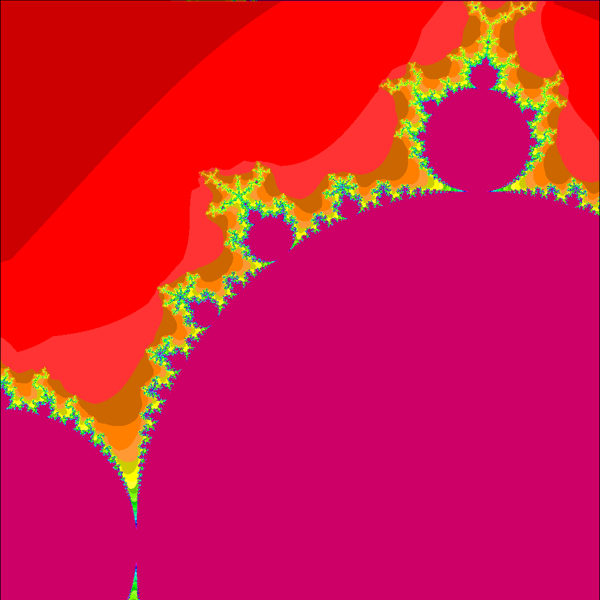
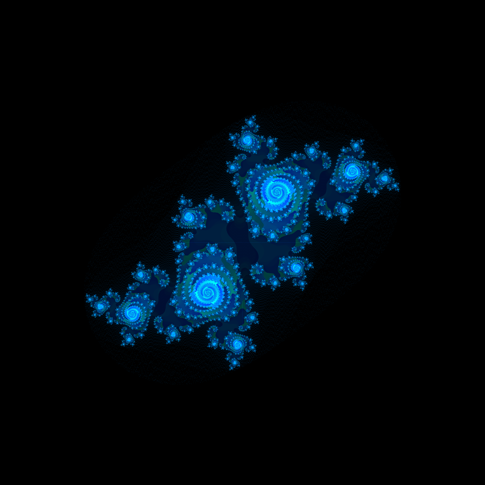
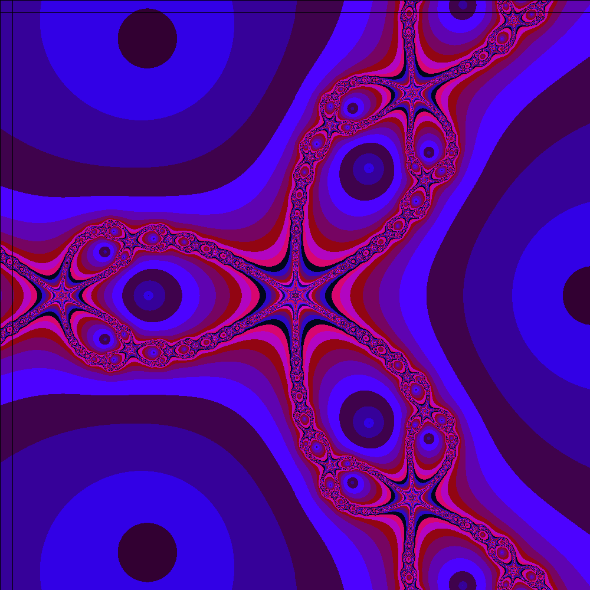
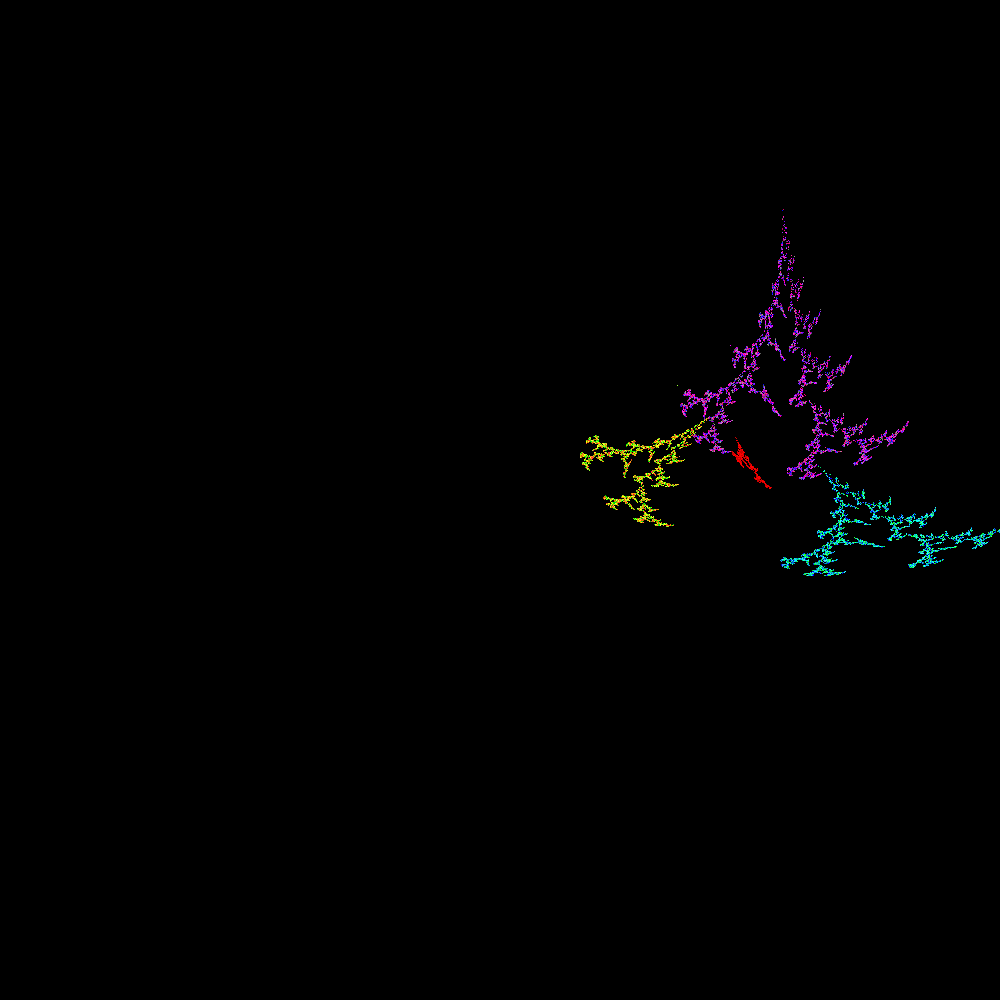

# Fractales

Hay 4 técnicas diferentes de dibujar fractales en este repo, en cada carpeta se almacena el algoritmo que lo genera junto con algunas imagenes generadas por cada código.

## Conjunto de Mandelbrot
Uno de los conjuntos fractales mas famosos, llamado así en honor a  Benoît Mandelbrot.

Aquí un ejemplo de la imagen generada por el código:

## Conjuntos de Julia
Otros de los conjuntos mas conocidos dentro del mundo fractal son los conjuntos de Julia en honor a Gaston Julia, los cuales hay una infinidad.

A continuación una muestra de estos fractales:

## Fractal de Newton
Este tipo de fractales son poco conocidos, su nombre se debe al proceso del método de Newton recursivo para encontrar raices.

## Fractal de Arbol
Este fractal, es muy descriptivo por su nombre, basicamente

